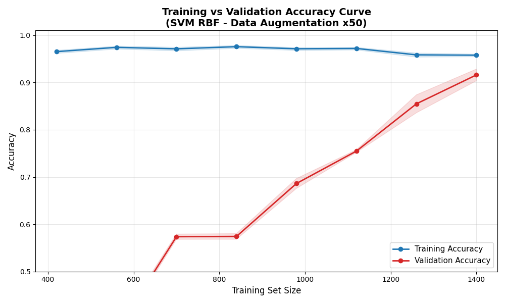
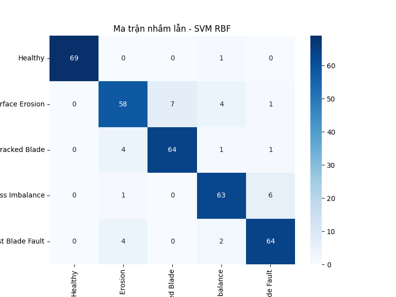

# Wind Turbine Blade State Prediction Model

**Dự đoán tình trạng cánh quạt turbine gió (Healthy / Surface Erosion / Cracked Blade / Mass Imbalance / Twist Blade Fault) dựa trên dữ liệu rung động (vibration) và mô hình SVM-RBF.**

---

## Mục tiêu

Xây dựng mô hình học máy **chẩn đoán lỗi cánh quạt turbine gió** từ tín hiệu rung động (uniaxial vibration) thu thập ở các tốc độ gió khác nhau, sử dụng **SVM với kernel RBF** kết hợp **trích xuất đặc trưng miền thời gian & tần số**, **tăng cường dữ liệu**, và **PCA**.

---

## Dataset

- **Nguồn**: [Mendeley Data – Wind Turbine Blades Fault Diagnosis based on Vibration Dataset Analysis](https://data.mendeley.com/datasets/5d7vbdp8f7/4)  
  `DOI: 10.17632/5d7vbdp8f7.4`
- **35 file** (CSV + XLSX), mỗi file ~500 mẫu, tần số lấy mẫu **1 kHz**
- **5 lớp**:
  1. `Healthy`
  2. `Surface Erosion`
  3. `Cracked Blade`
  4. `Mass Imbalance`
  5. `Twist Blade Fault`
- Tốc độ gió: **1.3 → 5.6 m/s**

---

## Cấu trúc thư mục

├── data/
│ ├── preprocessed-data/
│ │ └── merged_wind_turbine_data.csv
│ └── raw-data/
├── image/
├── model/
│ ├── wind_turbine_pca.pkl
│ ├── wind_turbine_scaler.pkl
│ └── wind_turbine_svm_rbf_model.pkl
├── preprocessing.ipynb
├── README.md
└── training.ipynb

---

## Thư viện sử dụng

- pandas: Xử lý dữ liệu bảng, đọc/ghi CSV/XLSX
- numpy: Tính toán mảng, augmentation
- scikit-learn: SVM, PCA, StandardScaler, GridSearchCV, metrics
- scipy: FFT, stats (skew, kurtosis)
- matplotlib & seaborn: Vẽ biểu đồ (learning curve, confusion matrix)
- joblib: Lưu/load mô hình
- openpyxl: Hỗ trợ đọc file XLSX

---

## Pipeline xử lý

1. **Tiền xử lý**

   - Gộp 35 file → `merged_wind_turbine_data.csv`
   - Chuẩn hóa cột (`Time`, `Amplitude`)
   - Trích xuất `wind_speed` từ tên file

2. **Tái cấu trúc**

   - Chia thành các đoạn **500 mẫu** (mỗi đoạn = 1 mẫu huấn luyện)

3. **Tăng cường dữ liệu (Data Augmentation ×50)**

   - Thêm nhiễu Gaussian
   - Dịch chuyển thời gian
   - Phóng to/thu nhỏ biên độ
   - Đảo ngược tín hiệu

4. **Trích xuất đặc trưng (13 đặc trưng)**  
   | Nhóm | Đặc trưng |
   |------|----------|
   | **Thời gian** | mean, std, max, min, skew, kurtosis, wind_speed mean/std, variation ratio |
   | **Tần số** | peak frequency, spectral energy, spectral entropy |

5. **Chuẩn hóa + PCA**

   - `StandardScaler`
   - `PCA` giữ **95% phương sai**

6. **Huấn luyện SVM-RBF**
   - `GridSearchCV` với `C`, `gamma`
   - `StratifiedKFold` (chỉ dùng fold hợp lệ)

---

## Kết quả mô hình (SVM-RBF)

| Chỉ số                  | Giá trị            |
| ----------------------- | ------------------ |
| **Training Accuracy**   | **96.43% ± 0.40%** |
| **Validation Accuracy** | **91.71% ± 1.42%** |

> **Mô hình ổn định, không overfit**, khoảng cách train/val ~5% là hợp lý với dữ liệu thực tế.

---

## Biểu đồ đánh giá

### Learning Curve (Training vs Validation Accuracy)



### Ma trận nhầm lẫn



---

## Cách huấn luyện lại

1. Đặt 35 file vào `data/raw-data/`
2. Chạy notebook theo thứ tự:
   ```bash
   jupyter notebook
   ```
3. File kết quả sẽ tự động lưu vào `data/preprocessed-data/`
