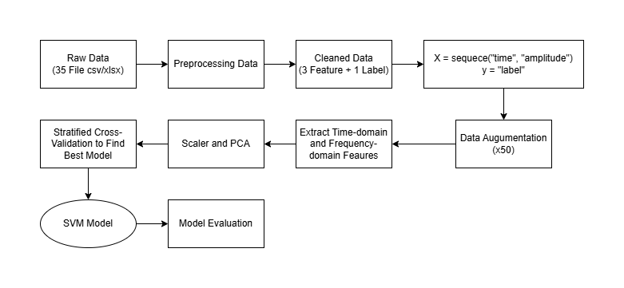
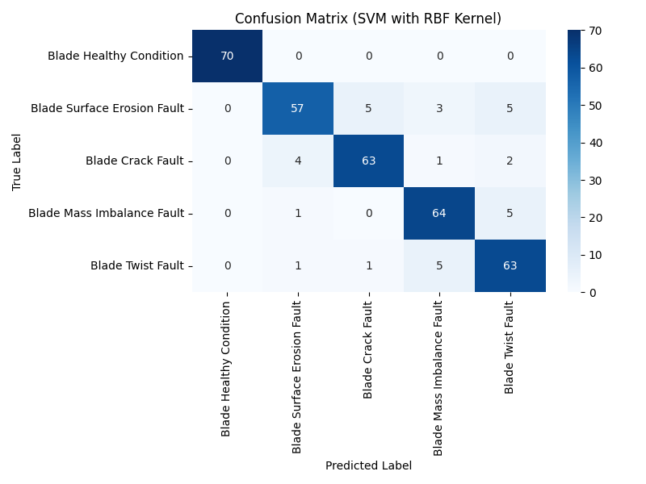

<h1 align="center">
Wind Turbine Blade State Prediction Model
</h1>

<p align="center" style="color:gray;">
(Mô hình dự đoán trạng thái cánh quạt Tuabin gió)
</p>

<hr>

# MỤC LỤC

- [Giới thiệu tổng quát](#giới-thiệu-tổng-quát)
- [Bộ dữ liệu](#bộ-dữ-liệu)
- [Cấu trúc mã nguồn](#cấu-trúc-mã-nguồn)
- [Công nghệ tiêu biểu](#công-nghệ-tiêu-biểu)
- [Một số hình ảnh](#một-số-hình-ảnh)

## GIỚI THIỆU TỔNG QUÁT

Đây là dự án xây dựng một mô hình máy học (Machine Learning) là **SVM - Support Vector Machine**, để dự đoán trạng thái của cánh quạt Tuabin gió (có 5 trạng thái, chi tiết nằm ở mục **[BỘ DỮ LIỆU](#bộ-dữ-liệu)**) với dữ liệu học được là tín hiệu rung động của cánh quạt (Vibration Signal Data) được đo ở nhiều mức độ gió khác nhau.

Bước đầu tiên khi xây dựng mô hình là thu thập hai đặc trưng cơ bản: `amplitude`, `wind_speed` và nhãn `label`; nhận được từ quá trình tiền xử lý (35 tập dữ liệu khác nhau được xử lý thành 1 tập dữ liệu chung có ba đặc trưng là `time`, `amplitude`, `wind_speed`, nhưng ta chỉ cần hai đặc trưng sau).

Tiếp theo, xử lý tập dữ liệu đã tiền xử lý thành **35 chuỗi** (Sequence) ứng với 35 tập dữ liệu trên, với mỗi chuỗi chứa một ma trận **500 x 2** (500 mẫu dữ liệu với hai đặc trưng cơ bản). Vì số chuỗi khá nhỏ nên ta sẽ tăng cường số chuỗi lên gấp **50 lần**, tức là sẽ có **1750 chuỗi** để mô hình học được nhiều hơn. Một số phương pháp tăng cường:

1. Additive Gaussian Noise (Thêm nhiễu Gauss)
2. Time Shifting (Dịch chuyển theo thời gian)
3. Amplitude Scaling (Thay đổi biên độ)
4. Time Reversal (Đảo ngược chuỗi thời gian)

Khi đã tăng cường xong, tiến hành trích xuất thêm đặc trưng ứng với mỗi chuỗi (mỗi chuỗi sẽ cho ra được hai Vector `amplitude`, `wind_speed` gồm 500 giá trị). Lúc này từ một Tensor **(1750, 500, 2)** sẽ biến thành một ma trận **1750 x 12**; tức là mỗi chuỗi sẽ có tất cả **12 đặc trưng** mới, với 9 đặc trưng thuộc miền thời gian (Time-domain Features) và 3 đặc trưng thuộc miền tần số (Frequency-domain Features).

Thông tin chi tiết về 12 đặc trưng mới:

| STT |  Loại đặc trưng  |          Tên biến           |                      Ý nghĩa                       |
| :-: | :--------------: | :-------------------------: | :------------------------------------------------: |
|  1  |   Time-domain    |      `mean_amplitude`       |      Giá trị trung bình của biên độ tín hiệu       |
|  2  |   Time-domain    |       `std_amplitude`       |            Mức độ dao động của biên độ             |
|  3  |   Time-domain    |       `max_amplitude`       |           Biên độ lớn nhất của tín hiệu            |
|  4  |   Time-domain    |       `min_amplitude`       |           Biên độ nhỏ nhất của tín hiệu            |
|  5  |   Time-domain    |      `skew_amplitude`       |        Độ bất đối xứng của phân bố biên độ         |
|  6  |   Time-domain    |    `kurtosis_amplitude`     |          Độ nhọn và mức độ xuất hiện xung          |
|  7  |   Time-domain    |      `mean_wind_speed`      |               Tốc độ gió trung bình                |
|  8  |   Time-domain    |      `std_wind_speed`       |          Mức độ biến động của tốc độ gió           |
|  9  |   Time-domain    | `amplitude_variation_ratio` | Mức độ biến thiên nhanh của biên độ theo thời gian |
| 10  | Frequency-domain |         `peak_freq`         |       Tần số chiếm ưu thế trong phổ tín hiệu       |
| 11  | Frequency-domain |      `spectral_energy`      |   Tổng năng lượng của tín hiệu trong miền tần số   |
| 12  | Frequency-domain |     `spectral_entropy`      |        Mức độ phân tán năng lượng trong phổ        |

Ta tiến hành chuẩn hoá (Scale) các điểm dữ liệu x trong ma trận theo công thức (mean và std tính theo từng cột thuộc tính):

```
x_scaled = (x - mean) / std
```

Việc này giúp mức độ ảnh hưởng của các đặc trưng là ngang nhau (với mean ≈ 0, std ≈ 1)

Sau đó đưa vào ma trận chuẩn hoá vào PCA - Principal Component Analysis để giảm chiều dữ liệu với mục tiêu là giữ được ít nhất là **95% phương sai** (hay 95% thông tin của dữ liệu). Khi quá trình hoàn tất, ma trận đặc trưng ta nhận được có kích thước **1750 x 9** (12 chiều giảm xuống còn 9 chiều), với 9 cột thuộc tính hiện tại ở đây là 9 Principal Components (thành phần chính) khác nhau.

Lúc này, bộ dữ liệu huấn luyện đã được hoàn tất với (X_reduced, y_augmented). Để tiến hành huấn luyện, chia bộ dữ liệu trên thành hai tập Train/Test với tỉ lệ **80%/20%**. Tiếp đó, đưa tập Train vào Stratified CV - Stratified Cross Validation rồi chia thành **5 Folds** - 4 tập Train nhỏ và 1 tập Validation nhỏ (tỉ lệ nhãn của mỗi Fold cân bằng với tỉ lệ nhãn toàn bộ tập Train) để đánh giá sự ổn định của tập dữ liệu huấn luyện.

Sau đó ta sẽ tinh chỉnh các siêu tham số (Hyperparameters) của mô hình SVM như:

1. Hệ số phạt `C`: [0.01, 0.1, 1, 10, 100]
2. Hệ số ảnh hưởng `gamma`: [`scale`, 0.001, 0.01, 0.1, 1]
3. Hàm hạt nhân `kernel`: `rbf` (Radial Basis Function)

Ở đây có tổ hợp 25 tổ hợp của bộ siêu tham số, cùng với 5 Folds dữ liệu nên sẽ có tất cả **125 lần huấn luyện** được diễn ra (với mỗi tổ hợp thì ta sẽ huấn luyện mô hình 5 lần ứng với 5 Folds). Việc tinh chỉnh sẽ được thực hiện bởi **GridSearchCV** để tìm ra siêu tham số tối ưu dành cho mô hình học máy SVM, phù hợp cho bài toán phân loại (Classification).

Cuối cùng, khi đã có tham số tối ưu, GridSearchCV sẽ tự huấn luyện mô hình với toàn bộ tập Train. Ta sẽ dùng tập Test để xem xét hiệu suất của mô hình.

**Ghi chú:** Đây chỉ là dự án thiết kế một mô hình máy học, vậy nên trong tương lai có thể sẽ được phát triển thành 1 dự án ứng dụng mô hình trong thực nghiệm hay thiết kế dạng Web App.

## BỘ DỮ LIỆU

Bài báo khoa học: https://www.sciencedirect.com/science/article/pii/S2352340923005152
Đường dẫn Dataset: https://data.mendeley.com/datasets/5d7vbdp8f7/4

Tập dữ liệu thô (Raw Data) của dự án này có tên là **Wind Turbine Blades Fault Diagnosis based on Vibration Dataset Analysis**, được lấy từ trang Web ScienceDirect.

Đây là đường dẫn đến một bài báo khoa học được đăng tạp chí Data in Brief, nói về một Dataset rung động từ cánh Tuabin gió bị lỗi dưới nhiều điều kiện khác nhau. Mục đích của bài báo trên là hỗ trợ phát triển và kiểm thử các phương pháp giám sát tình trạng và chẩn đoán lỗi trong Tuabin gió bằng cách phân tích tín hiệu rung.

**Thông tin mô tả của Dataset:** Gồm 35 File định dạng csv/xlsx chứa thông tin về tín hiệu rung động đơn trục (Uniaxial Vibration) đối với 5 tình trạng cánh quạt Tuabin gió:

1. **Blade Healthy Condition:** Cánh quạt hoạt động bình thường, không xuất hiện lỗi.
2. **Blade Surface Erosion Fault:** Bề mặt cánh bị mài mòn do môi trường.
3. **Blade Crack Fault:** Cánh quạt xuất hiện vết nứt vật liệu.
4. **Blade Mass Imbalance Fault:** Cánh quạt mất cân bằng khối lượng quay.
5. **Blade Twist Fault:** Cánh quạt bị xoắn, sai góc khí động.

Mỗi tình trạng của cánh quạt sẽ được thu thập với các mức tốc độ gió (Wind Speed) khác nhau: 1.3 m/s, 2.0 m/s, 2.1 m/s, ...

Trong từng File, dữ liệu tín hiệu rung động sẽ gồm có **500 mẫu**, với tần số lấy mẫu (Sampling Rate) là **1 hHz** và sẽ chứa 2 cột thuộc tính chính (các cột này sẽ có một số biến thể do chưa tiền xử lý):

1. **Time (s):** Thời gian lấy mẫu.
2. **Amplitude (V hoặc g):** Biên độ tín hiệu rung động.

Theo thông số kỹ thuật của cảm biến **PCB Piezotronics 352C65** trong bài báo khoa học phía trên, độ nhạy của cảm biến xấp xỉ 100 mV/g, do đó tín hiệu điện áp thu được có thể quy đổi sang gia tốc theo quy ước 1 V ≈ 10 g (với 1 g = 9.80665 m/s²).

## CẤU TRÚC MÃ NGUỒN

[data](data/) : Chứa các tập dữ liệu thô và sạch<br>
[model](model/) : Chứa mô hình và các thành phần được đóng gói<br>
[notebook](notebook/) : Chứa các Notebook xử lý tập dữ liệu và mô hình<br>
[picture](picture/) : Chứa danh mục hình ảnh

## CÔNG NGHỆ TIÊU BIỂU

Một số công nghệ được áp dụng trong dự án: Python, NumPy, Pandas, Scikit-learn (SVM, PCA, GridSearchCV), SciPy, Matplotlib, Seaborn, Joblib

## MỘT SỐ HÌNH ẢNH

<p align="center">
  
</p>

<p align="center"><i>Pipeline tổng thể của dự án.</i></p>

<br>

<p align="center">
  
</p>

<p align="center"><i>Ma trận nhầm lẫn của mô hình.</i></p>
